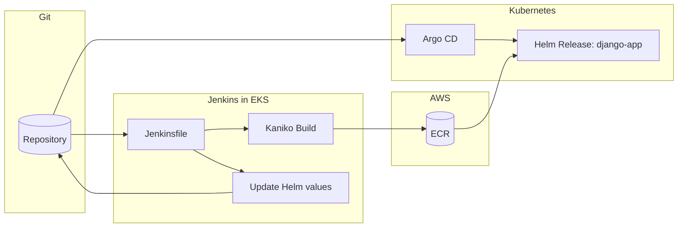

# Homework: CI/CD with Jenkins + Argo CD (Lessons 8-9)

This branch provisions a full CI/CD pipeline on EKS using Terraform, Jenkins, and Argo CD:

1. Jenkins builds a Docker image and pushes to ECR.
2. Jenkins updates `charts/django-app/values.yaml` with the new image tag and pushes to Git.
3. Argo CD watches the repo and syncs the application to the cluster automatically.

> Cost note: Jenkins and Argo CD are exposed via LoadBalancer services and incur AWS charges. Run `terraform destroy` after verification.

## What is included

- Terraform modules: S3/DynamoDB remote state backend, VPC, ECR, EKS cluster, EBS CSI driver, Jenkins, Argo CD
- Helm chart `django-app`: Django deployment (ECR image), PostgreSQL, ConfigMap, Service (LoadBalancer), HPA
- `Jenkinsfile`: Kaniko build → ECR push → Helm values Git commit
- Argo CD Application: auto-syncs `charts/django-app` from the `lesson-8-9` branch

## CI/CD Flow Diagram



## Prerequisites: Bootstrap Secrets

Jenkins admin credentials are stored in AWS Secrets Manager and never committed to Git.
Create the secret once before running `terraform apply`:

```bash
aws secretsmanager create-secret \
  --name "jenkins/admin" \
  --description "Jenkins initial admin credentials" \
  --secret-string '{"username":"admin","password":"<STRONG_PASSWORD>"}' \
  --region us-east-1
```

To use a different secret name, pass it as a Terraform variable:

```bash
terraform apply -var="jenkins_admin_secret_name=myapp/jenkins/admin"
```

## Apply Terraform

```bash
terraform init -backend=false -reconfigure
terraform apply -target=module.s3_backend   # creates S3 + DynamoDB
terraform init -migrate-state               # migrates local state → S3
terraform apply                             # creates VPC, ECR, EKS, Jenkins, Argo CD (~20 min)
```

Configure kubectl:

```bash
terraform output -raw eks_configure_kubeconfig | bash
```

## Jenkins: Verify Pipeline

1. Get the Jenkins service endpoint:

```bash
kubectl get svc -n jenkins
```

2. Retrieve the admin password from AWS Secrets Manager:

```bash
aws secretsmanager get-secret-value --secret-id jenkins/admin \
  --query SecretString --output text | jq -r .password
```

3. In Jenkins UI, add credentials:
   - **Manage Jenkins → Credentials → System → Global credentials → Add Credentials**
   - Kind: Username with password
   - Username: your GitHub username
   - Password: your GitHub PAT (needs `repo` scope)
   - ID: `github-token`

4. Create a Pipeline job from SCM:
   - **New Item** → name `django-app` → Pipeline
   - Pipeline script from SCM → Git
   - Repository: `https://github.com/VOSolyanik/goit-devops.git`
   - Branch: `*/lesson-8-9`
   - Script path: `Jenkinsfile`

5. Click **Build Now** — the first run will fail immediately (Jenkins loads pipeline parameters from the Jenkinsfile on first run). After it completes, click **Build with Parameters** and run again with defaults.

6. Expect stages:
   `Checkout` → `Resolve ECR coordinates` → `Build and push image (Kaniko)` → `Bump Helm values and push`

## Argo CD: Verify Sync

1. Get the Argo CD service endpoint:

```bash
kubectl get svc -n argocd
```

2. Get the initial admin password:

```bash
kubectl -n argocd get secret argocd-initial-admin-secret -o jsonpath="{.data.password}" | base64 -d
```

3. Log in to Argo CD UI (user: `admin`) and open the Application:
   - Name: `django-app`
   - Status should be **Synced** and **Healthy**

4. Verify the app is accessible:

```bash
kubectl get svc django-app-django   # EXTERNAL-IP = ELB DNS
```

## Cleanup

```bash
terraform destroy
```

---

## Known Pitfalls

### EKS node count
The default node group has `desired_size=1`. Running both Jenkins and Argo CD on a single `t3.small` node causes OOM evictions. Scale to at least 2 nodes before or after `terraform apply`:

```bash
aws eks update-nodegroup-config \
  --cluster-name lesson-8-9-eks \
  --nodegroup-name lesson-8-9-eks-nodes \
  --scaling-config minSize=1,maxSize=2,desiredSize=2 \
  --region us-east-1
```

### EKS token expiry during long `terraform apply`
EKS authentication tokens expire after ~15 minutes. If `terraform apply` takes longer, the Kubernetes provider will fail with a credentials error. Re-run `terraform apply` — it picks up a fresh token and completes.

### GitHub branch must exist on remote before creating Jenkins job
Create the Jenkins Pipeline job only after pushing the branch to GitHub. Jenkins fetches the Jenkinsfile from the remote on job creation; if the branch doesn't exist yet it will fail with `couldn't find remote ref`.

### Jenkins first build always fails
The first "Build Now" on a new Pipeline-from-SCM job fails immediately. This is expected: Jenkins reads the `parameters {}` block from the Jenkinsfile and registers them. Use **Build with Parameters** from the second run onward.

### Argo CD repo-server OOMKill
The default `384Mi` memory limit on the repo-server is too low for cloning a repo with Terraform files and rendering a Helm chart. The `modules/argo-cd/values.yaml` in this repo sets `768Mi` to avoid OOMKills. If you see repeated restarts of `argo-cd-argocd-repo-server`, increase the limit further.

### ELB DNS propagation delay
After `terraform apply` or after Argo CD deploys the `django-app` Service, the Classic ELB DNS name takes **3–5 minutes** to resolve. `ERR_NAME_NOT_RESOLVED` in the browser immediately after deployment is normal — wait and retry.
