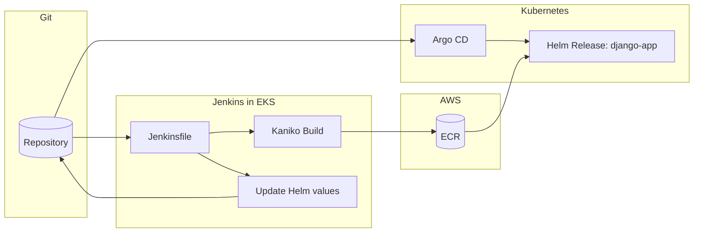

# Homework: EKS + Helm (Lesson 8-9)

This branch provisions an EKS cluster with Terraform and deploys a Django application to Kubernetes via Helm.

## What is included

- Terraform modules: S3/DynamoDB remote state backend, VPC, ECR, EKS cluster
- Helm chart `django-app`: Django deployment (ECR image), PostgreSQL, ConfigMap, Service (LoadBalancer), HPA
- Helm chart `metrics-server`: Kubernetes Metrics Server (required for HPA)

## Documentation

- [docs/terraform.md](docs/terraform.md) — modules, bootstrap flow, outputs
- [charts/README.md](charts/README.md) — chart architecture, deploy instructions

## Quick start

```bash
# 1. Bootstrap S3 backend, then provision all infrastructure
terraform init -backend=false -reconfigure
terraform apply -target=module.s3_backend   # creates S3 + DynamoDB
terraform init -migrate-state               # migrates local state → S3
terraform apply                             # creates VPC, ECR, EKS (~15 min)

# 2. Build and push the Django image to ECR
aws ecr get-login-password --region us-east-1 | \
  docker login --username AWS --password-stdin \
  $(terraform output -raw ecr_repository_url)

docker build --platform linux/amd64 \
  -t $(terraform output -raw ecr_repository_url):latest \
  ../django/
docker push $(terraform output -raw ecr_repository_url):latest

# Update image.repository in charts/django-app/values.yaml with the ECR URL

# 3. Configure kubectl
aws eks update-kubeconfig --region us-east-1 --name lesson-8-9-eks

# 4. Deploy Helm charts
helm repo add metrics-server https://kubernetes-sigs.github.io/metrics-server/
helm repo update

helm dependency update charts/metrics-server
helm upgrade --install metrics-server charts/metrics-server -n kube-system

helm dependency update charts/django-app
helm upgrade --install django-app charts/django-app
```

## Verify

```bash
kubectl get pods          # db-*, django-app-django-* all Running
kubectl get svc           # django-app-django EXTERNAL-IP = ELB DNS
kubectl get hpa           # min=2 max=6 CPU 70%
```

## Cleanup

```bash
helm uninstall django-app
helm uninstall metrics-server -n kube-system
terraform destroy
```

---

# Homework: CI/CD with Jenkins + Argo CD (Lessons 8-9)

This branch adds Jenkins and Argo CD on top of the lesson-8-9 EKS stack and wires a GitOps flow:

1. Jenkins builds a Docker image and pushes to ECR.
2. Jenkins updates charts/django-app/values.yaml with the new tag and pushes to Git.
3. Argo CD watches the repo and syncs the application automatically.

> Cost note: Jenkins and Argo CD are exposed via LoadBalancer services. This can create public IPs and incur charges. Remove resources after verification.

## CI/CD Flow Diagram



## Prerequisites: Bootstrap Secrets

Jenkins admin credentials are stored in AWS Secrets Manager and never committed to Git.
Create the secret once before running `terraform apply`:

```bash
aws secretsmanager create-secret \
  --name "jenkins/admin" \
  --description "Jenkins initial admin credentials" \
  --secret-string '{"username":"admin","password":"<STRONG_PASSWORD>"}' \
  --region us-east-1
```

To use a different secret name, pass it as a Terraform variable:

```bash
terraform apply -var="jenkins_admin_secret_name=myapp/jenkins/admin"
```

## Apply Terraform

```bash
terraform init -backend=false -reconfigure
terraform apply -target=module.s3_backend
terraform init -migrate-state
terraform apply
```

Configure kubectl:

```bash
terraform output -raw eks_configure_kubeconfig | bash
```

## Jenkins: Verify Pipeline

1. Get the Jenkins service endpoint:

```bash
kubectl get svc -n jenkins
```

2. Retrieve the admin password from AWS Secrets Manager (same value set during bootstrap):

```bash
aws secretsmanager get-secret-value --secret-id jenkins/admin \
  --query SecretString --output text | jq -r .password
```

3. In Jenkins UI, add credentials:
- ID: github-token
- Type: Username/Password
- Username: your GitHub username
- Password: your GitHub PAT

4. Create a Pipeline job from SCM:
- Repository: this repo
- Branch: lesson-8-9
- Script path: Jenkinsfile

5. Click **Build Now** — the first run will fail immediately (Jenkins loads pipeline parameters from the Jenkinsfile on first run). After it completes, click **Build with Parameters** and run again with defaults.

6. Expect stages:
`Checkout` → `Resolve ECR coordinates` → `Build and push image (Kaniko)` → `Bump Helm values and push`

## Argo CD: Verify Sync

1. Get the Argo CD service endpoint:

```bash
kubectl get svc -n argocd
```

2. Get the initial admin password:

```bash
kubectl -n argocd get secret argocd-initial-admin-secret -o jsonpath="{.data.password}" | base64 -d
```

3. Log in to Argo CD UI (user: admin) and open the Application:
- Name: django-app
- Status should be Synced and Healthy

## Cleanup

```bash
terraform destroy
```

---

## Known Pitfalls

### EKS node count
The default node group has `desired_size=1`. Running both Jenkins and Argo CD on a single `t3.small` node causes OOM evictions. Scale to at least 2 nodes before applying:

```bash
aws eks update-nodegroup-config \
  --cluster-name lesson-8-9-eks \
  --nodegroup-name lesson-8-9-eks-nodes \
  --scaling-config minSize=1,maxSize=2,desiredSize=2 \
  --region us-east-1
```

Or simply run `terraform apply` — the EKS Cluster Autoscaler is not deployed, but the node group max is 2 so manual scaling is the workaround.

### EKS token expiry during long `terraform apply`
EKS authentication tokens expire after ~15 minutes. If `terraform apply` takes longer (e.g., waiting for LoadBalancer provisioning), the Kubernetes provider will fail with a credentials error. Re-run `terraform apply` — it will pick up a fresh token and complete.

### Jenkins first build loads parameters — always fails
The first "Build Now" on a new Pipeline-from-SCM job fails immediately. This is expected: Jenkins reads the `parameters {}` block from the Jenkinsfile and registers them. Use **Build with Parameters** from the second run onward.

### Argo CD repo-server OOMKill
The default `384Mi` memory limit on the repo-server is too low for cloning a repo that contains Terraform files and rendering a Helm chart. The values.yaml in this repo sets `768Mi` to avoid OOMKills. If you see repeated restarts of `argo-cd-argocd-repo-server`, increase the limit further.

### ELB DNS propagation delay
After `terraform apply` or after Argo CD deploys the `django-app` Service, the Classic ELB DNS name takes **3–5 minutes** to resolve globally. `ERR_NAME_NOT_RESOLVED` in the browser immediately after deployment is normal — wait a few minutes and retry.
