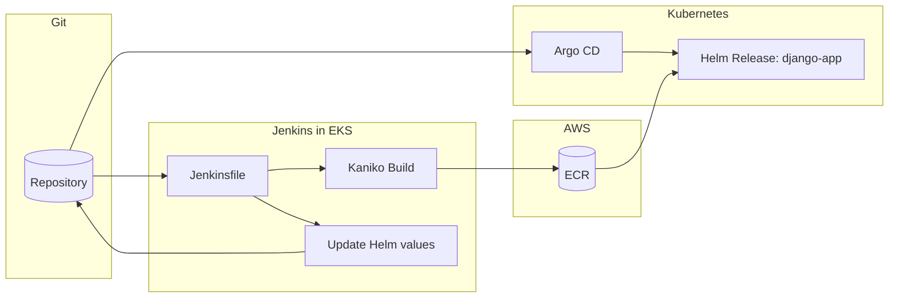

# GoIT DevOps — Homework

This repository contains homework assignments from the GoIT DevOps course.

Order in this README:

- **Lesson 10**: Terraform `rds` module (RDS / Aurora)
- **Lessons 8–9**: EKS, Jenkins, Argo CD, Helm, GitOps

---

## Repository Structure

| Path | Purpose |
|---|---|
| `main.tf`, `backend.tf`, `variables.tf`, `outputs.tf` | Root Terraform stack |
| `modules/vpc`, `modules/eks`, `modules/ecr`, `modules/s3-backend`, `modules/rds` | Network, cluster, registry, state backend, database |
| `modules/jenkins` | Jenkins Helm release + IRSA for `jenkins-sa` (ECR) |
| `modules/argo-cd` | Argo CD Helm release + local applications chart |
| `charts/django-app` | Application Helm chart (source for Argo CD + Jenkins tag update) |
| `django/` | Docker build context for Kaniko |
| `Jenkinsfile` | CI: Kaniko build, ECR push, Git commit |

---

## Homework (Lesson 10): Terraform `rds` Module (RDS / Aurora)

The repository includes a universal [`modules/rds`](modules/rds) module that creates:

- a **standard RDS instance** (PostgreSQL/MySQL) when `use_aurora = false`
- an **Aurora cluster + writer + readers** when `use_aurora = true`

In both cases the module creates a **DB Subnet Group**, **Security Group**, and **Parameter Group** (for Aurora — a cluster parameter group).

### Usage Example

In the root this is wired in [`main.tf`](main.tf) as `module "rds"`. Minimum required variables:

- `rds_master_password` (sensitive) — set in `terraform.tfvars` or via `TF_VAR_rds_master_password`
- `rds_use_aurora` — Aurora/RDS toggle

Example `terraform.tfvars` (do not commit):

```hcl
rds_master_password = "CHANGE_ME"
rds_use_aurora      = false
```

#### Standard RDS (PostgreSQL)

```hcl
module "rds" {
  source = "./modules/rds"

  name                       = "myapp-db"
  use_aurora                 = false
  engine                     = "postgres"
  engine_version             = "17.2"
  parameter_group_family_rds = "postgres17"

  instance_class          = "db.t3.micro"
  allocated_storage       = 20
  db_name                 = "appdb"
  username                = "postgres"
  password                = var.rds_master_password
  vpc_id                  = module.vpc.vpc_id
  subnet_private_ids      = module.vpc.private_subnet_ids
  subnet_public_ids       = module.vpc.public_subnet_ids
  publicly_accessible     = false
  multi_az                = false
  backup_retention_period = 0

  tags = { Environment = "dev" }
}
```

#### Aurora Cluster (PostgreSQL-compatible)

```hcl
module "rds" {
  source = "./modules/rds"

  name                          = "myapp-db"
  use_aurora                    = true
  engine_cluster                = "aurora-postgresql"
  engine_version_cluster        = "15.3"
  parameter_group_family_aurora = "aurora-postgresql15"
  aurora_replica_count          = 1

  instance_class      = "db.t3.medium"
  db_name             = "appdb"
  username            = "postgres"
  password            = var.rds_master_password
  vpc_id              = module.vpc.vpc_id
  subnet_private_ids  = module.vpc.private_subnet_ids
  subnet_public_ids   = module.vpc.public_subnet_ids
  publicly_accessible = false

  tags = { Environment = "dev" }
}
```

### Module Variables

The module accepts (see full details in [`modules/rds/variables.tf`](modules/rds/variables.tf)):

- **`use_aurora`**: `true/false` — switches Aurora vs standard RDS
- **RDS-only**: `engine`, `engine_version`, `parameter_group_family_rds`, `allocated_storage`, `multi_az`
- **Aurora-only**: `engine_cluster`, `engine_version_cluster`, `parameter_group_family_aurora`, `aurora_replica_count`
- **Network**: `vpc_id`, `subnet_private_ids`, `subnet_public_ids`, `publicly_accessible`
- **Common**: `name`, `instance_class`, `db_name`, `username`, `password`, `backup_retention_period`, `parameters`, `tags`

### How to Change DB Type / Engine / Instance Class

- **Switch to Aurora**: set `rds_use_aurora = true` (this **destroys** `aws_db_instance` and creates an Aurora cluster in the same state)
- **Change RDS engine**: update `engine` / `engine_version` and the corresponding `parameter_group_family_rds` in `module "rds"`
- **Change Aurora engine**: update `engine_cluster` / `engine_version_cluster` and `parameter_group_family_aurora`
- **Change instance class**: `instance_class = "db.t3.micro"` (or any other supported class)

> **Free tier note**: the module defaults `backup_retention_period = 0` for standard RDS (to avoid free plan limits). For Aurora, 0 is automatically raised to 1 day minimum.

---

## Homework (Lessons 8–9): EKS, Jenkins, Argo CD, Helm, GitOps

The project uses **Terraform** to provision **VPC → EKS → ECR**, installs **Jenkins** and **Argo CD** via **Helm**, deploys the **Django** Helm chart from `charts/django-app`, and runs a **Jenkinsfile** with **Kaniko → ECR → Git commit** so that **Argo CD** pulls the application from the repository (GitOps).

**Submission branch:** `lesson-8-9` (matches `gitops_target_revision` and the default `GIT_PUSH_BRANCH` parameter in Jenkins).

---

## CI/CD Flow Diagram



**Steps:**

1. Code changes land in Git; Jenkins triggers a pipeline from `Jenkinsfile`.
2. **Kaniko** builds the image from `django/Dockerfile` and pushes to **ECR** (agent uses **`jenkins-sa`** + **IRSA**).
3. The **Git** stage updates `charts/django-app/values.yaml` (`image.repository` / `image.tag`) and pushes to the target branch (default `lesson-8-9`).
4. The **Application** in Argo CD watches the same path in the repo; **auto-sync** is enabled (`prune`, `selfHeal` in `modules/argo-cd/argo_cd.tf`).

---

## Prerequisites

- **Terraform** `>= 1.6`
- **AWS CLI** configured with permissions for EKS, EC2, IAM, ECR, S3, Secrets Manager
- **kubectl**; **Helm** — recommended for verifying releases
- **GitHub PAT** with `repo` scope — used by the Jenkins pipeline Git push step

**Jenkins credentials:** stored in AWS Secrets Manager (`jenkins/admin`). Create once before `terraform apply`:

```bash
aws secretsmanager create-secret \
  --name "jenkins/admin" \
  --description "Jenkins initial admin credentials" \
  --secret-string '{"username":"admin","password":"<STRONG_PASSWORD>"}' \
  --region us-east-1
```

---

## Apply Terraform

```bash
terraform init -backend=false -reconfigure
terraform apply -target=module.s3_backend   # creates S3 + DynamoDB
terraform init -migrate-state               # migrates local state → S3
terraform apply -var="rds_master_password=<STRONG_PASSWORD>"   # creates all resources (~20 min)
```

Configure kubectl:

```bash
terraform output -raw eks_configure_kubeconfig | bash
```

Useful outputs:

```bash
terraform output ecr_repository_url
terraform output rds_standard_endpoint
terraform output argo_cd_admin_password_command
```

---

## Jenkins: Verify Pipeline

1. Get the Jenkins service endpoint:

```bash
kubectl get svc -n jenkins
```

2. Retrieve the admin password from AWS Secrets Manager:

```bash
aws secretsmanager get-secret-value --secret-id jenkins/admin \
  --query SecretString --output text | jq -r .password
```

3. In Jenkins UI, add credentials:
   - **Manage Jenkins → Credentials → System → Global credentials → Add Credentials**
   - Kind: Username with password
   - Username: your GitHub username
   - Password: your GitHub PAT (needs `repo` scope)
   - ID: `github-token`

4. Create a Pipeline job from SCM:
   - **New Item** → name `django-app` → Pipeline
   - Pipeline script from SCM → Git
   - Repository: `https://github.com/VOSolyanik/goit-devops.git`
   - Branch: `*/lesson-8-9`
   - Script path: `Jenkinsfile`

5. Click **Build Now** — the first run will fail immediately (Jenkins loads pipeline parameters from the Jenkinsfile on first run). After it completes, click **Build with Parameters** and run again with defaults.

6. Expect stages:
   `Checkout` → `Resolve ECR coordinates` → `Build and push image (Kaniko)` → `Bump Helm values and push`

---

## Argo CD: Verify Sync

1. Get the Argo CD service endpoint:

```bash
kubectl get svc -n argocd
```

2. Get the initial admin password:

```bash
kubectl -n argocd get secret argocd-initial-admin-secret -o jsonpath="{.data.password}" | base64 -d
```

3. Log in to Argo CD UI (user: `admin`) and open the Application:
   - Name: `django-app`
   - Status should be **Synced** and **Healthy**

4. Verify the app is accessible:

```bash
kubectl get svc django-app-django   # EXTERNAL-IP = ELB DNS
```

---

## Cleanup

```bash
terraform destroy -var="rds_master_password=<STRONG_PASSWORD>"
```

---

## Known Pitfalls

### EKS node count
The default node group has `desired_size=1`. Running both Jenkins and Argo CD on a single `t3.small` node causes OOM evictions. Scale to at least 2 nodes before or after `terraform apply`:

```bash
aws eks update-nodegroup-config \
  --cluster-name lesson-8-9-eks \
  --nodegroup-name lesson-8-9-eks-nodes \
  --scaling-config minSize=1,maxSize=2,desiredSize=2 \
  --region us-east-1
```

### EKS token expiry during long `terraform apply`
EKS authentication tokens expire after ~15 minutes. If `terraform apply` takes longer, the Kubernetes provider will fail with a credentials error. Re-run `terraform apply` — it picks up a fresh token and completes.

### GitHub branch must exist on remote before creating Jenkins job
Create the Jenkins Pipeline job only after pushing the branch to GitHub. Jenkins fetches the Jenkinsfile from the remote on job creation; if the branch doesn't exist yet it will fail with `couldn't find remote ref`.

### Jenkins first build always fails
The first "Build Now" on a new Pipeline-from-SCM job fails immediately. This is expected: Jenkins reads the `parameters {}` block from the Jenkinsfile and registers them. Use **Build with Parameters** from the second run onward.

### Argo CD repo-server OOMKill
The default `384Mi` memory limit on the repo-server is too low for cloning a repo with Terraform files and rendering a Helm chart. The `modules/argo-cd/values.yaml` in this repo sets `768Mi` to avoid OOMKills. If you see repeated restarts of `argo-cd-argocd-repo-server`, increase the limit further.

### ELB DNS propagation delay
After `terraform apply` or after Argo CD deploys the `django-app` Service, the Classic ELB DNS name takes **3–5 minutes** to resolve. `ERR_NAME_NOT_RESOLVED` in the browser immediately after deployment is normal — wait and retry.
