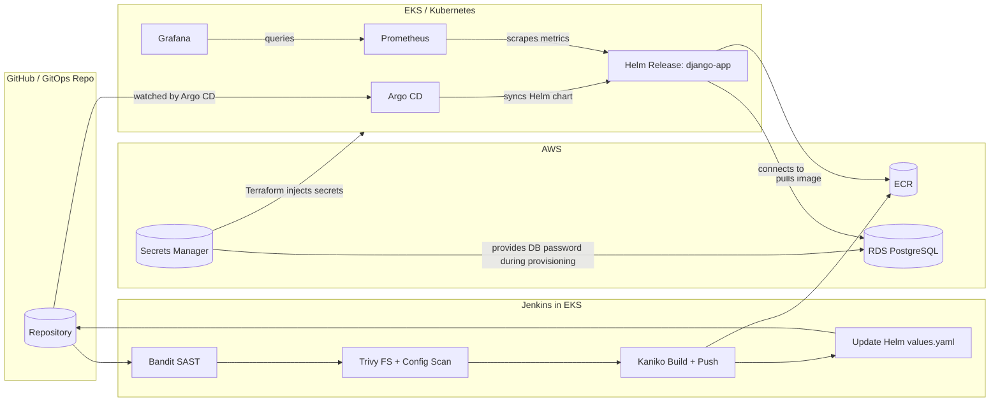
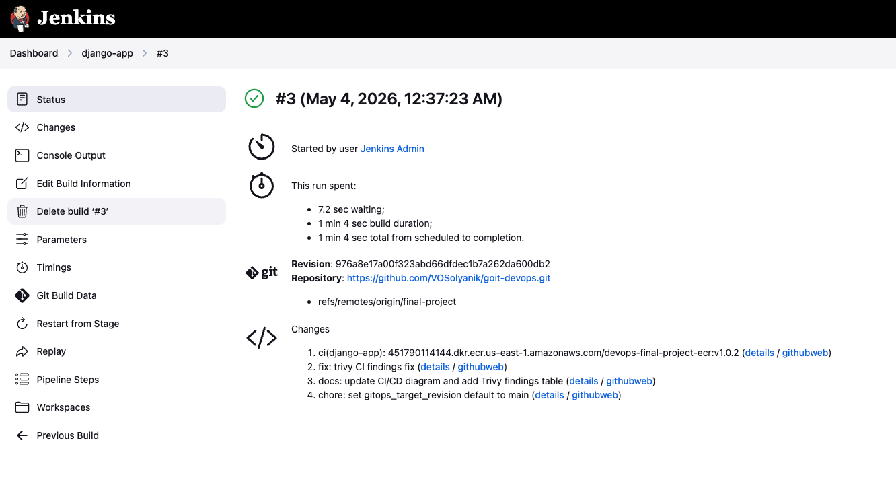
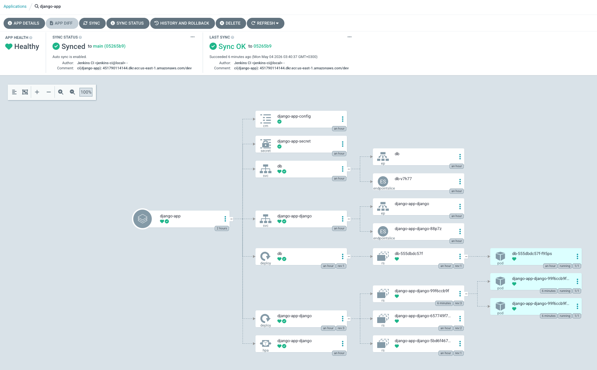
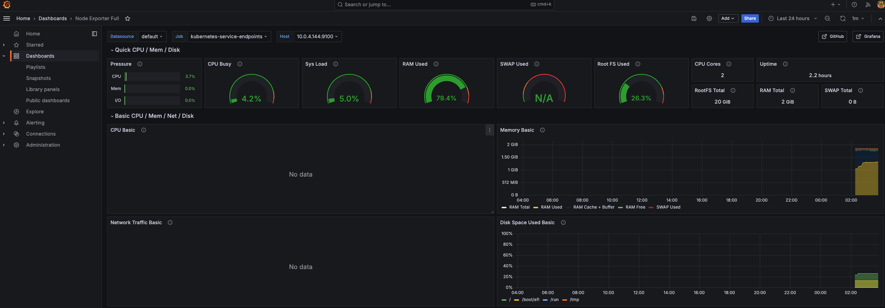
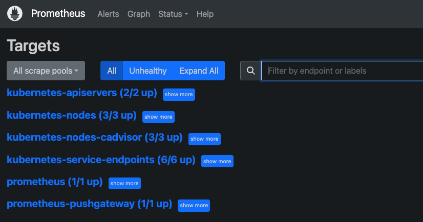

# GoIT DevOps — Final Project

Full DevOps infrastructure on AWS: VPC, EKS, ECR, RDS, Jenkins, Argo CD, Prometheus, Grafana — provisioned with Terraform, delivered via GitOps.

**Branch:** `final-project`

---

## Repository Structure

| Path | Purpose |
|---|---|
| `main.tf`, `backend.tf`, `variables.tf`, `outputs.tf` | Root Terraform stack |
| `modules/vpc` | VPC, subnets, IGW, NAT gateway |
| `modules/eks` | EKS cluster + managed node group + EBS CSI driver |
| `modules/ecr` | ECR repository |
| `modules/s3-backend` | S3 bucket + DynamoDB for Terraform state |
| `modules/rds` | RDS / Aurora (switchable via `rds_use_aurora`) |
| `modules/jenkins` | Jenkins Helm release + IRSA for `jenkins-sa` (ECR) |
| `modules/argo-cd` | Argo CD Helm release + local applications chart |
| `modules/monitoring` | Prometheus + Grafana Helm releases, Node Exporter dashboard |
| `charts/django-app` | Application Helm chart (source for Argo CD + Jenkins tag update) |
| `django/` | Docker build context for Kaniko |
| `Jenkinsfile` | CI: Bandit SAST, Trivy scan, Kaniko build, ECR push, Git commit |

---

## CI/CD Flow



1. Jenkins pipeline runs **Bandit** (Python SAST) and **Trivy** (CVE + IaC scan) before building.
2. **Kaniko** builds the image from `django/Dockerfile` and pushes to **ECR** via IRSA.
3. The **Git** stage updates `charts/django-app/values.yaml` and pushes to `final-project`.
4. **Argo CD** auto-syncs (`prune`, `selfHeal`) the django-app Helm chart.
5. **Prometheus** scrapes cluster metrics; **Grafana** visualises them (Node Exporter Full dashboard pre-loaded).

---

## Prerequisites

- **Terraform** `>= 1.6`
- **AWS CLI** with permissions for EKS, EC2, IAM, ECR, S3, Secrets Manager
- **kubectl** and **Helm** (for verifying releases)
- **GitHub PAT** with `repo` scope (Jenkins Git push step)

**Create Secrets Manager secrets before `terraform apply`** — all sensitive credentials are stored here, never in Terraform variables:

```bash
aws secretsmanager create-secret \
  --name jenkins/admin \
  --secret-string '{"username":"admin","password":"<STRONG_PASSWORD>"}' \
  --region us-east-1

aws secretsmanager create-secret \
  --name rds/master \
  --secret-string '{"password":"<STRONG_PASSWORD>"}' \
  --region us-east-1

aws secretsmanager create-secret \
  --name grafana/admin \
  --secret-string '{"password":"<STRONG_PASSWORD>"}' \
  --region us-east-1
```

---

## Deploy

### Bootstrap S3 state backend (first run only)

The S3 bucket and DynamoDB table must exist before Terraform can use them as a backend. Comment out `backend.tf`, bootstrap, then re-enable:

```bash
# 0. Clear stale provider cache if re-deploying after a destroy
rm -rf .terraform

# 1. Comment out the backend "s3" block in backend.tf
terraform init
terraform apply -target=module.s3_backend -auto-approve

# 2. Uncomment backend.tf, then migrate local state → S3
terraform init -migrate-state
```

### Full apply

```bash
terraform apply -auto-approve   # ~20 min
```

No `-var` flags needed — all passwords are fetched from Secrets Manager.

> **Tip:** After EKS comes up (~10 min into the apply), scale the node group to 2 in a separate terminal to prevent Helm release timeouts:
> ```bash
> aws eks update-nodegroup-config \
>   --cluster-name devops-final-project-eks \
>   --nodegroup-name devops-final-project-eks-nodes \
>   --scaling-config minSize=1,maxSize=2,desiredSize=2 \
>   --region us-east-1
> ```

Configure kubectl:

```bash
terraform output -raw eks_configure_kubeconfig | bash
```

Useful outputs:

```bash
terraform output ecr_repository_url
terraform output rds_standard_endpoint
terraform output grafana_port_forward_command
terraform output prometheus_port_forward_command
terraform output argo_cd_admin_password_command
```

---

## Verify Jenkins

1. Get the Jenkins URL:

```bash
kubectl get svc -n jenkins
```

2. Retrieve the admin password:

```bash
aws secretsmanager get-secret-value --secret-id jenkins/admin \
  --query SecretString --output text | jq -r .password
```

3. Add a GitHub credential in Jenkins UI:
   - **Manage Jenkins → Credentials → Global → Add** → Username with password
   - Username: your GitHub username, Password: GitHub PAT, ID: `github-token`

4. Create a Pipeline job from SCM:
   - **New Item** → `django-app` → Pipeline → Script from SCM
   - Repository: `https://github.com/VOSolyanik/goit-devops.git`
   - Branch: `*/final-project`, Script path: `Jenkinsfile`

5. **Build Now** — first run loads pipeline parameters and will fail. Use **Build with Parameters** from the second run.

6. Expected stages: `Checkout` → `SAST: Bandit` → `Security scan: Trivy` → `Resolve ECR coordinates` → `Build and push image (Kaniko)` → `Bump Helm values and push`



---

## Verify Argo CD

```bash
kubectl get all -n argocd
kubectl port-forward svc/argocd-server 8081:443 -n argocd
```

Open `https://localhost:8081`, login as `admin`, password:

```bash
kubectl -n argocd get secret argocd-initial-admin-secret \
  -o jsonpath="{.data.password}" | base64 -d
```

Application `django-app` should show **Synced** and **Healthy**.



---

## Verify Monitoring

```bash
kubectl get all -n monitoring
```

**Grafana:**

```bash
kubectl port-forward svc/grafana 3000:80 -n monitoring
```

Open `http://localhost:3000`, login `admin` / your `grafana/admin` secret password.

The **Node Exporter Full** dashboard (ID 1860) is pre-imported. The Prometheus data source is pre-configured at `http://prometheus-server.monitoring.svc:80`.



**Prometheus:**

```bash
kubectl port-forward svc/prometheus-server 9090:80 -n monitoring
```

Open `http://localhost:9090` to run PromQL queries directly.



---

## DevSecOps

Every Jenkins build runs two security scan stages before Kaniko:

| Stage | Tool | What it scans |
|-------|------|--------------|
| `SAST: Bandit (Python)` | [Bandit](https://bandit.readthedocs.io) | Django source for SQLi, hardcoded secrets, insecure calls |
| `Security scan: Trivy` | [Trivy](https://aquasecurity.github.io/trivy) | `trivy fs` — Python deps + Dockerfile CVEs; `trivy config` — Terraform + K8s YAML misconfigurations |

Both stages use `--exit-code 0` / `--exit-zero` (informational). To enforce a hard gate, change to `--exit-code 1` / remove `--exit-zero` in `Jenkinsfile`.

### Trivy findings from first CI run

Findings from `trivy config` on the full workspace. Fixed and accepted findings documented below.

#### Fixed

| ID | Severity | Resource | Fix applied |
|----|----------|----------|-------------|
| DS-0002 | HIGH | `django/Dockerfile` | Added `USER appuser` — container no longer runs as root |
| AWS-0031 | HIGH | `modules/ecr/ecr.tf` | Set `image_tag_mutability = "IMMUTABLE"` — prevents tag overwrite |

#### Accepted (not fixed)

| ID | Severity | Resource | Why accepted |
|----|----------|----------|--------------|
| AWS-0039 | HIGH | `modules/eks/eks.tf` | EKS secret envelope encryption requires a KMS key, which adds cost and IAM complexity beyond the scope of this project |
| AWS-0040 | CRITICAL | `modules/eks/eks.tf` | `endpoint_public_access = true` is required so `kubectl` can reach the cluster from a local workstation; disabling it would require a bastion host or VPN |
| AWS-0041 | CRITICAL | `modules/eks/eks.tf` | `public_access_cidrs = ["0.0.0.0/0"]` is intentional for the same reason — locking to a single IP would break the course setup for anyone not on a static IP |
| AWS-0080 | HIGH | `modules/rds/rds.tf` | RDS storage encryption requires a KMS key; not justified for a disposable lab instance with no real data |
| AWS-0104 | CRITICAL | `modules/rds/shared.tf` | Unrestricted egress on the RDS security group — outbound traffic from a database inside a private VPC subnet poses minimal risk and is the default AWS pattern |
| AWS-0132 | HIGH | `modules/s3-backend/s3.tf` | S3 state bucket uses AES256 (SSE-S3). A customer-managed KMS key (SSE-KMS) would add rotation and audit controls but is unnecessary cost overhead for a Terraform state backend in a learning project |
| AWS-0164 | HIGH | `modules/vpc/vpc.tf` | `map_public_ip_on_launch = true` on public subnets is required — the NAT gateway and load balancer need public IPs; removing this would break internet connectivity for the cluster |

---

## RDS Module

The [`modules/rds`](modules/rds) module supports both standard RDS and Aurora via a single toggle:

| Variable | Default | Description |
|----------|---------|-------------|
| `use_aurora` | `false` | `true` → Aurora cluster + writer + reader |
| `engine` | `"postgres"` | RDS engine |
| `engine_version` | `"17.2"` | RDS engine version |
| `instance_class` | `"db.t3.micro"` | Instance class for RDS and Aurora |
| `allocated_storage` | `20` | GB (RDS only) |
| `backup_retention_period` | `0` | Days (Aurora enforces minimum 1) |
| `db_port` | `5432` | Security group ingress port |

Password is read from Secrets Manager `rds/master` — never passed as a variable.

To switch to Aurora: set `rds_use_aurora = true` in `variables.tf` (or pass via `-var`).

---

## Cleanup

```bash
terraform destroy -auto-approve
```

This also destroys the S3 bucket and DynamoDB table. On next deploy, start from the **Bootstrap** step above.

---

## Known Pitfalls

### EKS node count
The default node group has `desired_size=1`. Running Jenkins, Argo CD, Prometheus, and Grafana together on a single `t3.small` node causes OOM evictions. Scale to at least 2 nodes:

```bash
aws eks update-nodegroup-config \
  --cluster-name devops-final-project-eks \
  --nodegroup-name devops-final-project-eks-nodes \
  --scaling-config minSize=1,maxSize=2,desiredSize=2 \
  --region us-east-1
```

### EKS token expiry during long `terraform apply`
EKS authentication tokens expire after ~15 minutes. If `terraform apply` takes longer, the Kubernetes provider will fail with a credentials error. Re-run `terraform apply` — it picks up a fresh token and completes.

### S3 backend deleted after `terraform destroy`
`terraform destroy` removes the S3 bucket and DynamoDB table used for state. On next deploy, comment out `backend.tf` first, bootstrap with `-target=module.s3_backend`, then migrate state back to S3.

### GitHub branch must exist on remote before creating Jenkins job
Create the Jenkins Pipeline job only after pushing the branch to GitHub. Jenkins fetches the Jenkinsfile from the remote on job creation; if the branch doesn't exist yet it will fail with `couldn't find remote ref`.

### Jenkins first build always fails
The first "Build Now" on a new Pipeline-from-SCM job fails immediately — Jenkins reads the `parameters {}` block and registers them. Use **Build with Parameters** from the second run onward.

### Argo CD repo-server OOMKill
The default `384Mi` memory limit on the repo-server is too low for cloning a repo with Terraform files and rendering a Helm chart. `modules/argo-cd/values.yaml` sets `768Mi`. If you see repeated restarts of `argo-cd-argocd-repo-server`, increase it further.

### ELB DNS propagation delay
After `terraform apply` or after Argo CD deploys the `django-app` Service, the ELB DNS name takes **3–5 minutes** to resolve. `ERR_NAME_NOT_RESOLVED` immediately after deployment is normal — wait and retry.

### Helm releases stuck in `pending-install` after a killed `terraform apply`
If `terraform apply` is killed mid-run, Helm releases may be left in `pending-install` state. A subsequent `terraform apply` will fail with `cannot re-use a name that is still in use`. Fix:

```bash
helm uninstall <release> -n <namespace>   # repeat for each stuck release
terraform import module.<mod>.kubernetes_namespace.<ns> <ns>
terraform import module.<mod>.kubernetes_storage_class_v1.ebs_sc ebs-sc
terraform import module.<mod>.kubernetes_service_account.<sa> <ns>/<sa>
terraform apply -auto-approve
```

### Stale state lock after a killed `terraform apply`
A killed apply leaves a DynamoDB lock. The next run fails with `Error acquiring the state lock`. Copy the lock ID from the error and force-unlock:

```bash
terraform force-unlock -force <LOCK_ID>
```

### Alertmanager PVC AZ affinity conflict on second node
When the second EKS node is in a different AZ than the first, a PVC created during an earlier (failed) install can get bound to the wrong AZ. The alertmanager pod stays `Pending` with `volume node affinity conflict`. Fix — delete the stale PVC and restart the pod so a fresh PVC is created in the correct AZ:

```bash
kubectl delete pvc storage-prometheus-alertmanager-0 -n monitoring
kubectl delete pod prometheus-alertmanager-0 -n monitoring
```

### Prometheus Helm release times out while nodes are scaling
The default Helm timeout (5 min) is too short when pods are waiting for a second EKS node to join. `modules/monitoring/monitoring.tf` sets `timeout = 900` (15 min) to handle this. If you still see `context deadline exceeded`, re-run `terraform apply` — Prometheus is likely already Running.
